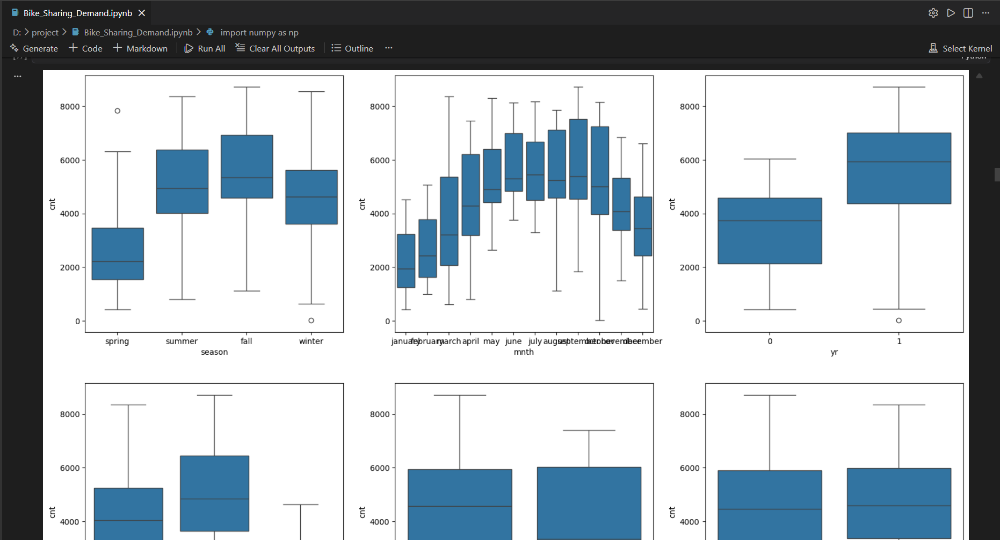
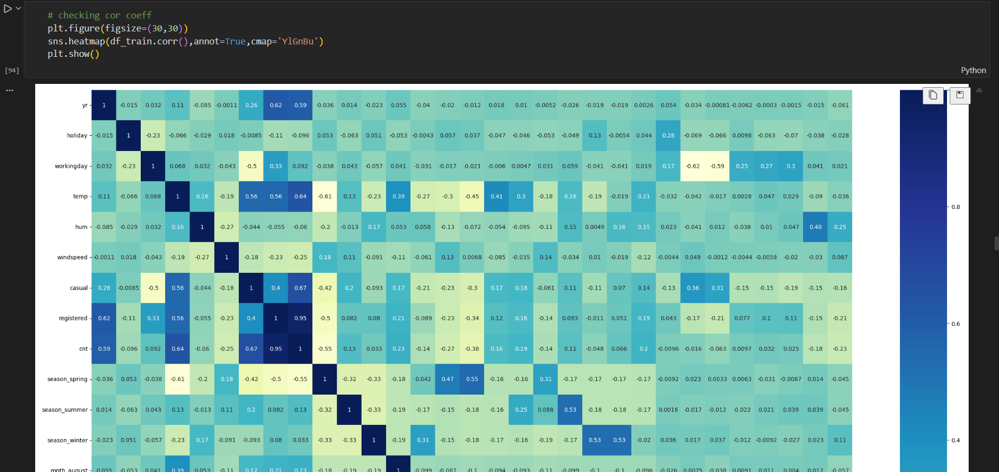

# 🚲 Bike Sharing Demand Prediction

Machine Learning project to predict bike rental demand using weather and seasonal features.

## 📌 Techniques Used
- Data Cleaning
- Exploratory Data Analysis (EDA)
- Feature Engineering
- Regression Models
- Model Evaluation

## 📊 Data Visualization

### Seasonal & Monthly Analysis

### Correlation Heatmap

