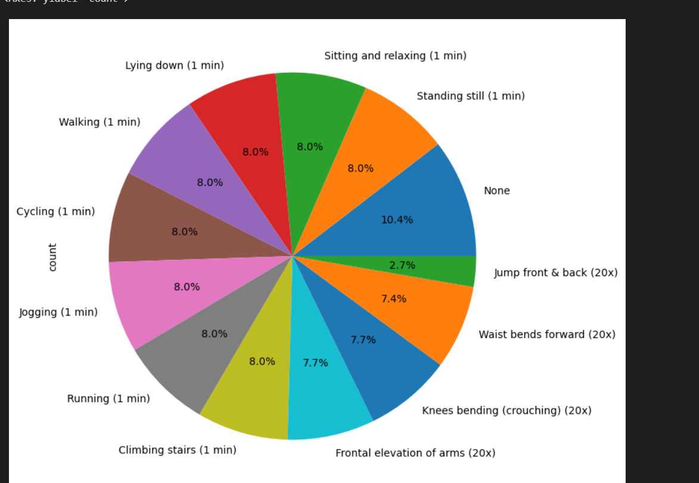
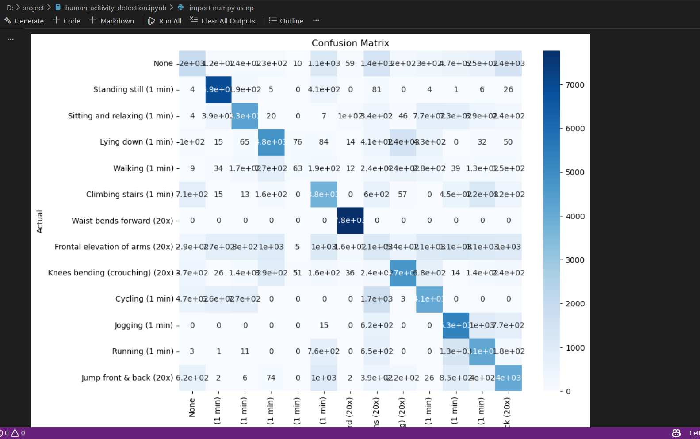

# 🕺 Human Activity Detection

Machine Learning project for recognizing and classifying different human activities using motion sensor data and machine learning techniques.

---

# 📌 Project Overview

This project analyzes sensor-based human activity data to identify activities such as:
- Walking
- Running
- Jogging
- Cycling
- Sitting
- Standing
- Climbing Stairs
- Lying Down
- Jumping
- Arm Movements

The project uses data preprocessing, visualization, and classification techniques to improve activity recognition accuracy.

---

# 🛠️ Technologies Used

- Python
- NumPy
- Pandas
- Matplotlib
- Seaborn
- Scikit-learn
- Jupyter Notebook

---

# 📊 Data Visualization

## Activity Distribution

---

## Sensor Distribution Analysis

---

## Confusion Matrix

---

# 📌 Techniques Used

- Data Cleaning & Preprocessing
- Exploratory Data Analysis (EDA)
- Feature Engineering
- Sensor Data Analysis
- Machine Learning Classification
- Model Evaluation

---

# 📈 Model Evaluation

The model performance was evaluated using:
- Accuracy Score
- Confusion Matrix
- Classification Analysis

---

# ⚠️ Note

The original dataset file was too large to upload to GitHub.

---

# 👨‍💻 Author

Machine Learning enthusiast passionate about AI, Data Science, and Computer Vision.
