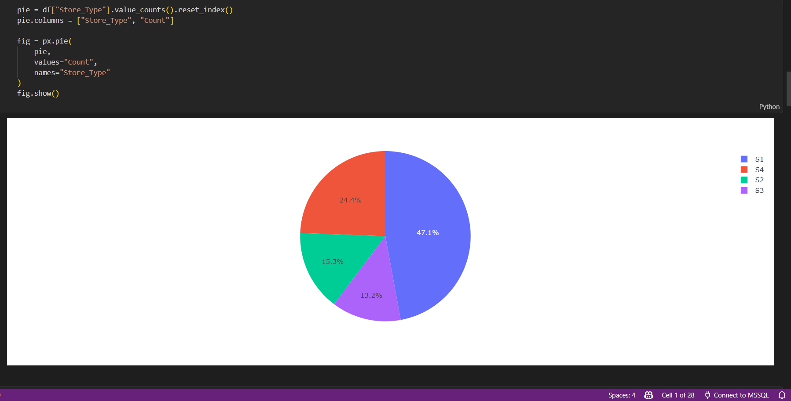

# 📦 Order Prediction

Machine Learning project for predicting order demand and analyzing sales trends using historical business data and visualization techniques.

---

# 📌 Project Overview

This project focuses on analyzing sales and order-related data to understand business trends and predict future order demand using machine learning and data analysis techniques.

The project includes:
- Data preprocessing
- Exploratory Data Analysis (EDA)
- Visualization of sales trends
- Store type analysis
- Prediction modeling

---

# 🛠️ Technologies Used

- Python
- NumPy
- Pandas
- Matplotlib
- Plotly
- Seaborn
- Scikit-learn
- Jupyter Notebook

---

# 📊 Data Visualization

## Sales Distribution

---

## Store Type Distribution

---

# 📌 Techniques Used

- Data Cleaning
- Data Visualization
- Feature Engineering
- Regression Models
- Sales Trend Analysis
- Prediction Systems

---

# 📈 Model Evaluation

The project evaluates prediction performance using data analysis and visualization methods.

---

# ⚠️ Note

Large dataset files were not uploaded to GitHub due to size limitations.

---

# 👨‍💻 Author

Machine Learning enthusiast passionate about AI, Data Science, and Predictive Analytics.
